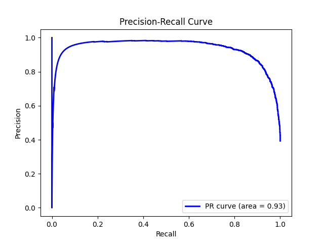

# AI-Text-Detector
The objective of this project is to develop a robust machine learning model capable of distinguishing between human-written and AI-generated texts. This capability is increasingly crucial as AI-generated text becomes more sophisticated, necessitating tools to verify the authenticity and origin of digital content.

## Table of Contents

- [Installation](#Installation)
- [Running the Application](#Running-the-Application)
- [Dataset Overview](#Dataset-Overview)
- [Data Preparation](#Data-Preparation)
- [Feature Engineering](#Feature-Engineering)
- [Advanced Text Features and Dimensionality Reduction](#Advanced-Text-Features-and-Dimensionality-Reduction)
- [Why Logistic Regression?](#Why-Logistic-Regression?)
- [Model Evaluation](#Model-Evaluation)

## Installation

1. Clone the repository: 
```bash
git clone https://github.com/your-username/AI-Text-Detector.git
```
2. Navigate to the project directory:
```bash
cd AI-Text-Detector
```
3. Create and activate a virtual environment (optional but recommended): 
```bash
python3 -m venv venv
source venv/bin/activate # On Linux/Mac
venv\Scripts\activate.bat # On Windows
```
4. Install dependencies: 
```bash
pip3 install -r requirements.txt
```

## Running the Application
- **Run the application:** Start the application by running `python src/main.py` in your terminal.
- **Using the application:** Once the model is built, you can input text directly into the terminal.
- **Results:** After entering your text, the application will display an output indicating the probability that the text is human-written or AI-generated.
- **Exit:** To Exit, simply type "Exit" into the terminal.


## Dataset Overview
Central to our project is a carefully compiled dataset composed entirely of essays, which forms the basis for training our model to discern between human and AI authorship. This focus on essays is particularly relevant as it encompasses a range of linguistic and stylistic nuances that challenge the differentiation capabilities of our model.
The dataset can be found [here](https://www.kaggle.com/datasets/sunilthite/llm-detect-ai-generated-text-dataset).

## Data Preparation

The preprocessing of essays is a crucial step in standardizing the text for machine learning applications, ensuring that our model is trained on data that accurately represents the characteristics we aim to analyze. The initial phase of preprocessing involved cleaning the essays to remove extraneous characters and formatting. This process was meticulously executed using a custom method to strip out punctuation and unnecessary whitespace, which could otherwise skew the analysis.

### Processing Steps

1. **Removing Punctuation:** Punctuation marks were removed to standardize the text. This step was carefully considered, as punctuation could be a feature in future models. However, for the current model framework, simplifying the text by removing punctuation helps focus on the textual content.
2. **Tokenization:** The cleaned text was then tokenized, splitting it into manageable units or words. This step is critical as it transforms the text into a format that our machine learning algorithms can interpret effectively.
3. **Lowercasing:** All tokens were converted to lowercase to ensure uniformity, eliminating any discrepancies that case differences might introduce.
4. **Stopwords Removal:** Commonly used words, or stopwords, which typically do not contribute to the meaning of the text, such as 'I', 'am', 'there', were removed. This reduces the dimensionality of the data and focuses the model's learning on words with more substantive predictive power.
5. **Reassembly:** The processed tokens were reassembled into a continuous string, preparing them for vectorization.

## Feature Engineering

Our aim is to distinguish between human-written and AI-generated texts. One of the critical initial steps was to enrich our dataset with features that could potentially reveal significant differences in writing styles between the two categories. This process, known as feature engineering, involved the creation of a variety of textual features derived from the raw text data. We implemented this in the Python function `add_features(data)`, designed to systematically augment the dataset with new, informative features.

### Breakdown of Feature Engineering Steps

- **Character Count (char_count):** This feature measures the total number of characters in each text, providing a basic size metric that reflects text length.
- **Word Count (word_count):** We calculated the total number of words per text. This feature helps in understanding the verbosity or conciseness of the text.
- **Capital Character Count (capital_char_count):** By counting the number of uppercase characters, this feature could indicate the use of emphasis or formal writing styles.
- **Capital Word Count (capital_word_count):** This counts the number of words that are entirely in uppercase, which might be indicative of specific stylistic features or emphases in the text.
- **Punctuation Count (punctuation_count):** We counted the occurrences of punctuation marks, as they can reflect complexity and the structure of the sentences.
- **Quoted Word Count (quoted_word_count):** This counts the number of words within quotes, which could highlight dialogue or references in texts.
- **Sentence Count (sent_count):** By counting the number of sentences, this feature helps in understanding text composition in terms of sentence structuring.
- **Unique Word Count (unique_word_count):** This represents the number of unique words used, shedding light on lexical diversity.
- **Stopword Count (stopword_count):** Counting common stopwords can provide insights into the filler or functional components of the text.
- **Average Word Length (avg_word_length):** This feature is calculated as the ratio of char_count to word_count, providing an average size of the words used, which can reflect on the complexity or readability of the text.
- **Unique Words vs. Total Words Ratio (unique_vs_words):** It shows the proportion of unique words to total words, another indicator of lexical diversity.
- **Stopwords vs. Total Words Ratio (stopwords_vs_words):** This measures the density of stopwords in the text, which can indicate writing style or the level of formality/informality.

### Feature Engineering Evaluation
In the process of refining our machine learning model, we conducted a feature relevance analysis to identify which variables significantly influence our target variable "generated". During this analysis, we calculated the correlation coefficients for each feature relative to the target.

#### Correlation of Features

- **Description:**
  - We visualized the correlation coefficients of each feature relative to the target variable "generated" to understand their impact on the model's performance.
  


## Advanced Text Features and Dimensionality Reduction

In our quest to enhance the predictive performance of our machine learning model, designed to differentiate between human-written and AI-generated texts, we implemented advanced techniques:

### Bigram Integration

We adjusted our feature extraction process by incorporating bigrams alongside unigrams using the TfidfVectorizer. This was achieved by setting the `ngram_range` parameter to `(1, 2)`, thereby instructing the vectorizer to extract and consider both single words (unigrams) and pairs of consecutive words (bigrams). This allows our model to capture nuanced linguistic patterns and contextual relationships between words, thus enhancing its classification accuracy.

### Dimensionality Reduction with Truncated SVD

To address the challenge of increased dimensionality resulting from the enriched feature set, we applied Truncated Singular Value Decomposition (Truncated SVD). This technique reduces the number of dimensions while preserving crucial data patterns, ensuring computational efficiency and mitigating the risk of overfitting.

These enhancements represent an iterative refinement process, aimed at optimizing our model's performance and efficiency. While increasing the complexity of our feature space, we carefully evaluate the impact on model metrics such as accuracy, precision, recall, and F1-scores, ensuring robustness and generalizability to new data.

## Why Logistic Regression?

1. **Probabilistic Nature:** Logistic Regression is fundamentally a probabilistic model, which means it doesn’t just predict a binary outcome but provides the probability of the occurrence of an event. This feature is particularly advantageous for our application because we aimed to not only classify texts as human or AI-generated but also quantify the likelihood (as a probability) of each classification. This helps in assessing the confidence of the predictions.

2. **Interpretability:** One of the standout features of Logistic Regression is its interpretability. Each feature's coefficient indicates the strength and direction of its relationship with the dependent variable, in this case, the likelihood of a text being AI-generated. This is valuable in a domain like ours where understanding what influences the model's predictions can provide insights into how AI and human texts differ.

3. **Efficiency:** Logistic Regression is computationally not intensive, making it an excellent choice for high-dimensional datasets, especially after feature engineering and dimensionality reduction via methods like Truncated SVD. This efficiency is crucial in maintaining manageable computation times and resource usage.

4. **Performance with Linear Decision Boundaries:** Despite its simplicity, Logistic Regression can perform quite well in cases where the relationship between the independent variables and the log-odds of the dependent variable is linear, which we hypothesized might be the case in our scenario given the nature of the features extracted.

## Model Evaluation

- **Confusion Matrix:**
  - A Confusion Matrix is a tabular representation of actual vs predicted class labels. It provides insights into our model’s performance by breaking down the predictions into true positives, false positives, true negatives, and false negatives. In our model's case, there were 2010 true positives to 257 false positives and 3282 true negatives to 280 false negatives. This means that our model was able to correctly predict if the text was written by human or AI 90.7% of the time.
  

- **Precision-Recall Curve:**
  - A Precision-Recall curve demonstrates how our model’s precision and recall change with different threshold values. Precision measures how often our model correctly identifies AI-generated texts, while recall measures how many of the actual AI-generated texts our model successfully detects. Our diagram shows that the area under our Precision-Recall curve is 0.93, which demonstrates that our model maintains high precision (the ability to detect human vs AI written text) while also maintaining a high recall (the ability to detect most AI generated text).
  

- **ROC Curve:**
  - The Receiver Operating Characteristic (ROC) curve demonstrates how well our model distinguishes between human and AI written text by plotting the true positive rate against the false positive rate at different thresholds. Our diagram shows that the area under the ROC curve is 0.96, which indicates that when our model classifies a text as AI-generated, it is correct 96% of the time.
  

